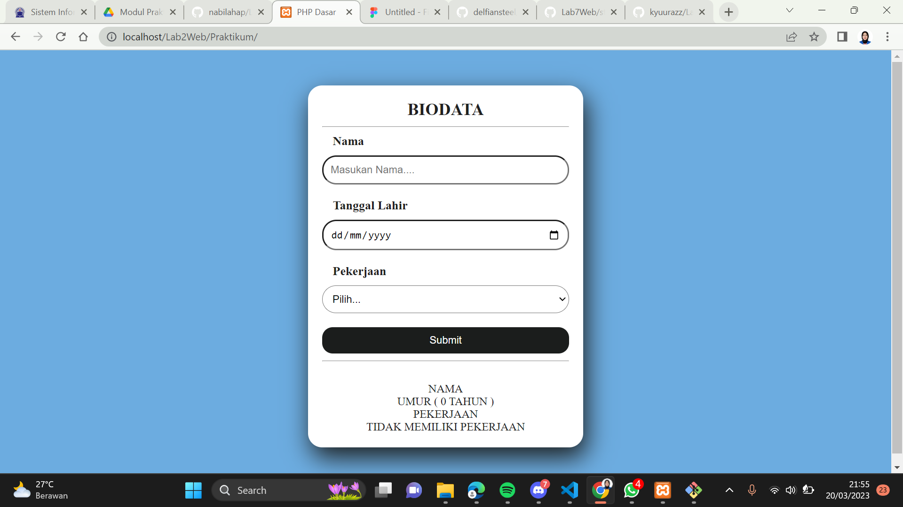

# Lab2Web
### Profil
__Nama  : Nabilah Ananda Putri__

__Nim   : 312110263__

__Kelas : T1.21.A.1__

## Latihan 1

```py
<!DOCTYPE html>
<html lang="en">

<head>
    <meta charset="UTF-8">
    <title>PHP Dasar</title>
</head>

<body>
    <h1>Belajar PHP Dasar</h1>
    <?php
    echo "Hello World";
    ?>

    <h2>Menggunakan Variable</h2>
    <?php
    $nim = "312110263";
    $nama = 'Nabilah Ananda Putri';
    echo "NIM : " . $nim . "<br>";
    echo "Nama : $nama";
    ?>

</body>

</html>
```

## Latihan 2

```py
<body>
  <!-- Variabel $_GET -->
  <h4>Predefine Variable</h4>
  <?php
  echo 'Selamat Datang ' . $_GET['nama']
  ?>
</body>
```

## Latihan 3

```py
<!DOCTYPE html>
<html lang="en">
<head>
  <meta charset="UTF-8">
  <meta http-equiv="X-UA-Compatible" content="IE=edge">
  <meta name="viewport" content="width=device-width, initial-scale=1.0">
  <title>PHP DASAR</title>
</head>
<body>
  <h2>Form Input</h2>
  <form action="" method="post">
    <label for="">Nama : </label>
    <input type="text" name="nama" placeholder="Masukan Nama">
    <input type="submit" value="kirim">
  </form>
  <?php
  echo "Selamat Datang " . $_POST['nama'];
  ?>
</body>
</html>
```

## Latihan 4

```py
<body>
  <?php
  $gaji = 1000000;
  $pajak = 0.1;
  $thp = $gaji - ($gaji * $pajak);
  echo "Gaji sebelum pajak = Rp. $gaji <br>";
  echo "Gaji yang dibawa pulang = Rp. $thp";
  ?>
</body>
```

## Latihan 5

```py
<body>
  <h2>Kondisi IF</h2>
  <?php
  $nama_hari = date("l");
  if ($nama_hari == "Sunday") {
    echo "Minggu";
  } elseif ($nama_hari == "Monday") {
    echo "Senin";
  } else {
    echo "Selasa";
  }
  ?>
</body>
```

## Latihan 6

```py
<h2>Kondisi Switch</h2>
<?php
$nama_hari = date("l");
switch ($nama_hari) {
  case "Sunday":
    echo "Minggu";
    break;
  case "Monday":
    echo "Senin";
    break;
  case "Tuesday":
    echo "Selasa";
    break;
  default:
    echo "Sabtu";
}
echo "/$nama_hari";
?>
```

## Latihan 7

```py
<h2>Perulangan For</h2>
  <?php
  echo "Perulangan 1 sampai 10 <br />";
  for ($i = 1; $i <= 10; $i++) {
    echo "Perulangan ke: " . $i . '<br />';
  }
  echo "Perulangan Menurun dari 10 ke 1 <br />";
  for ($i = 10; $i >= 1; $i--) {
    echo "Perulangan ke: " . $i . '<br />';
  }
  ?>
```

## Latihan 8

```py
<h2>Perulangan While</h2>
<?php
echo "Perulangan 1 sampai 10 <br />";
$i = 1;
while ($i <= 10) {
  echo "Perulangan ke: " . $i . '<br />';
  $i++;
}
?>
```

## Latihan 9

```py
<h2>Perulangan Do while</h2>
<?php
echo "Perulangan 1 sampai 10 <br />";
$i = 1;
do {
  echo "Perulangan ke: " . $i . '<br />';
  $i++;
} while ($i <= 10);
?>
```

## Praktikum
- Buatlah program PHP sederhana dengan menggunakan form input yang menampilkan nama, tanggal
lahir dan pekerjaan. Kemudian tampilkan outputnya dengan menghitung umur berdasarkan inputan
tanggal lahir. Dan pilihan pekerjaan dengan gaji yang berbeda-beda sesuai pilihan pekerjaan.


